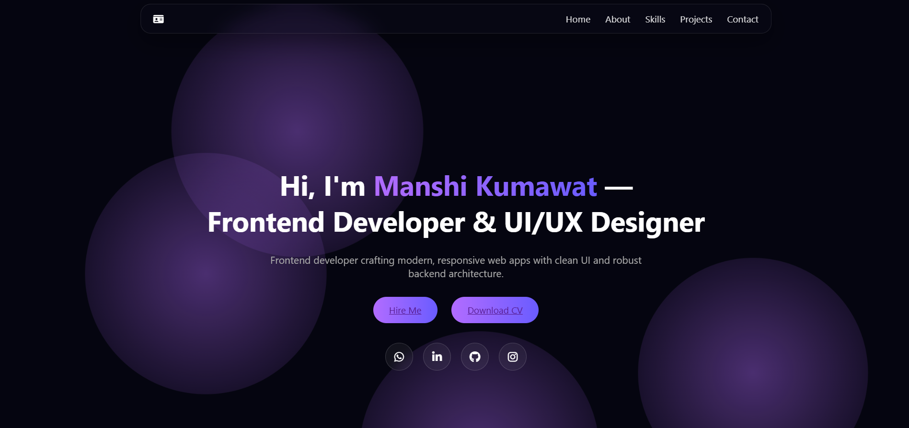

# 🌐 Manshi-Kumawat.dev – Personal Portfolio Website
 💻 Manshi-Kumawat.dev is a modern, responsive personal portfolio website showcasing my projects, skills, and development journey. The platform highlights my expertise in frontend development, UI/UX design, and full-stack project building while providing an interactive way for recruiters and collaborators to explore my work.

 # 🛠 Tech Stack
 Frontend: HTML5, CSS3, JavaScript
Design & UI: Figma, Glassmorphism UI, Gradient Animations
Libraries & Tools: Font Awesome, EmailJS
Deployment: GitHub Pages / Vercel

# 🚀 Features
✨ Fully Responsive Portfolio Design
✨ Animated Hero Section & Background Effects
✨ Skills Progress Animation with Scroll Reveal
✨ Interactive Projects Showcase with Live & GitHub Links
✨ Development Journey Timeline Section
✨ Contact Form with EmailJS Integration
✨ Glassmorphism Sticky Navigation Bar

# 📌 Sections Included
Nav Ba,
Hero Section,
About Me,
Skills & Technologies,
Featured Projects,
Development Journey Timeline,
Contact Section,
Footer,

# 🌍 Live Demo
🔗 https://manshi-kumawat.dev

#  📬 Contact
If you'd like to collaborate or discuss opportunities:

LinkedIn: https://linkedin.com/in/manshi-kumawat

GitHub: https://github.com/Manshikmt3

Email: manshikumawat13@gmail.com

# ⭐ Author
# Manshi Kumawat
Frontend Developer & UI/UX Designer
